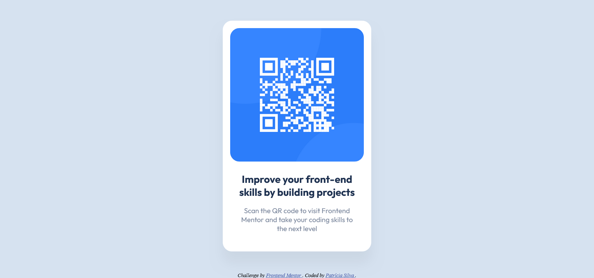

# Frontend Mentor - QR code component solution

This is a solution to the [QR code component challenge on Frontend Mentor](https://www.frontendmentor.io/challenges/qr-code-component-iux_sIO_H). Frontend Mentor challenges help you improve your coding skills by building realistic projects. 

## Table of contents

- [Overview](#overview)
  - [Screenshot](#screenshot)
  - [Links](#links)
- [My process](#my-process)
  - [Built with](#built-with)
  - [What I learned](#what-i-learned)
  - [Useful resources](#useful-resources)
- [Author](#author)

## Overview

### Screenshot

### Links

- [Solution](https://github.com/patriciarrs/Frontend-Mentor-QR-code-component)
- [Live Site](https://patriciarrs.github.io/Frontend-Mentor-QR-code-component/)

## My process

### Built with

- Semantic HTML5 markup
- Flexbox

### What I learned

Since this is a simple component, I kept this solution as simple as possible.

I add to search how to add Google fonts and a style sheet.

I also learned how to use Figma to find out the font size, the spacing between elements and the shadow values for the component.

### Useful resources

- [Box-sizing](https://developer.mozilla.org/en-US/docs/Web/CSS/box-sizing#try_it) - It is often useful to set box-sizing to border-box to lay out elements. This makes dealing with the sizes of elements much easier, and generally eliminates a number of pitfalls. I really liked this pattern and will use it going forward.

## Author

- Frontend Mentor - [@patriciarrs](https://www.frontendmentor.io/profile/patriciarrs)
